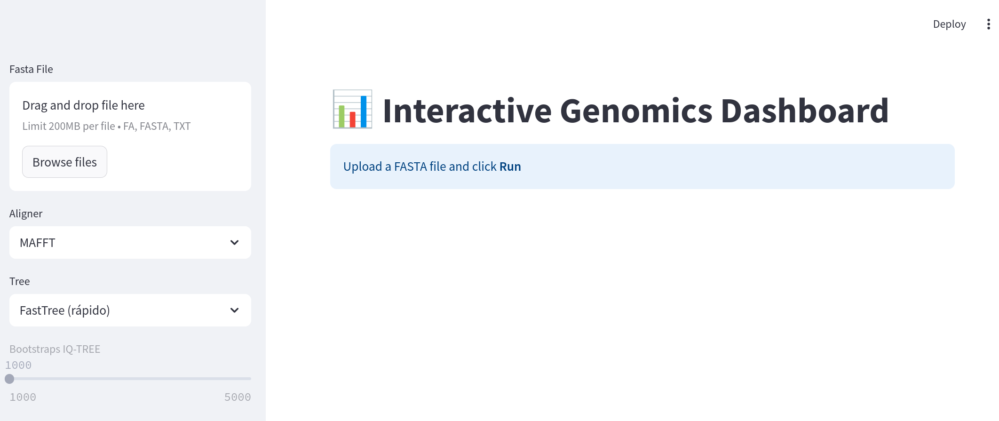
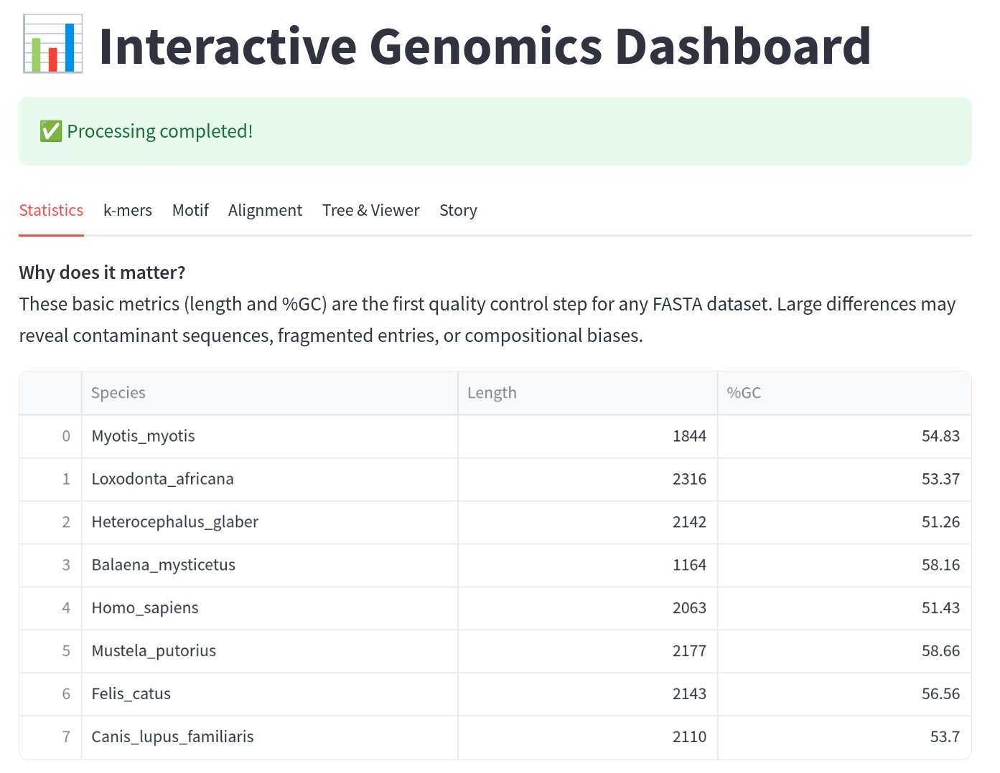
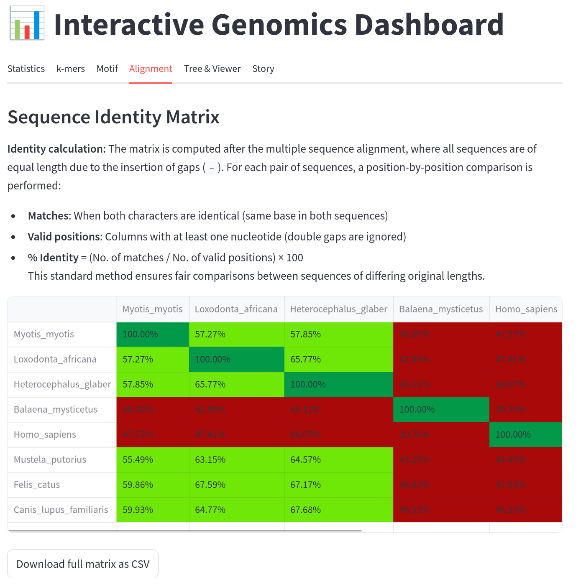
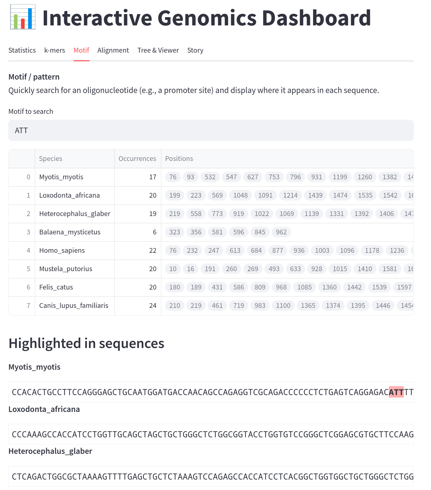
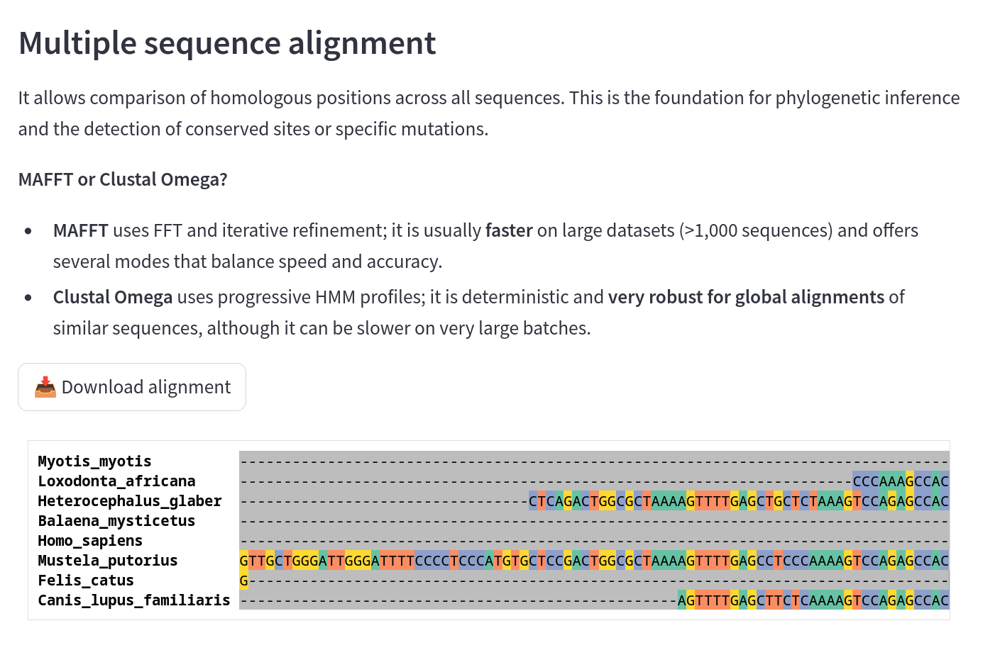
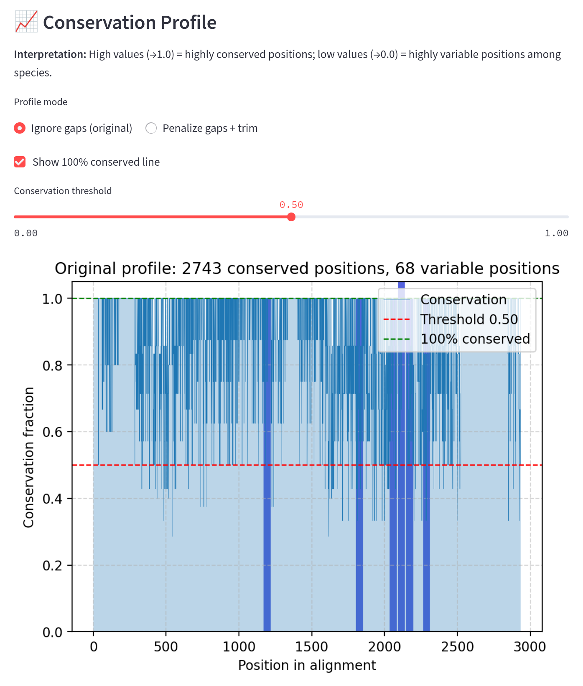
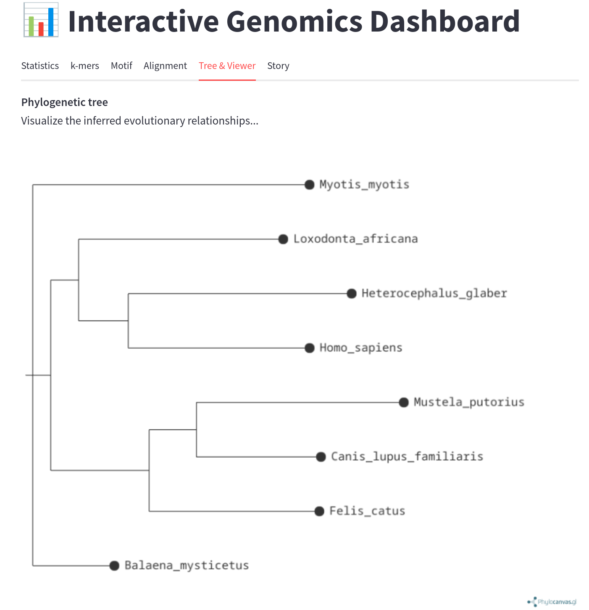
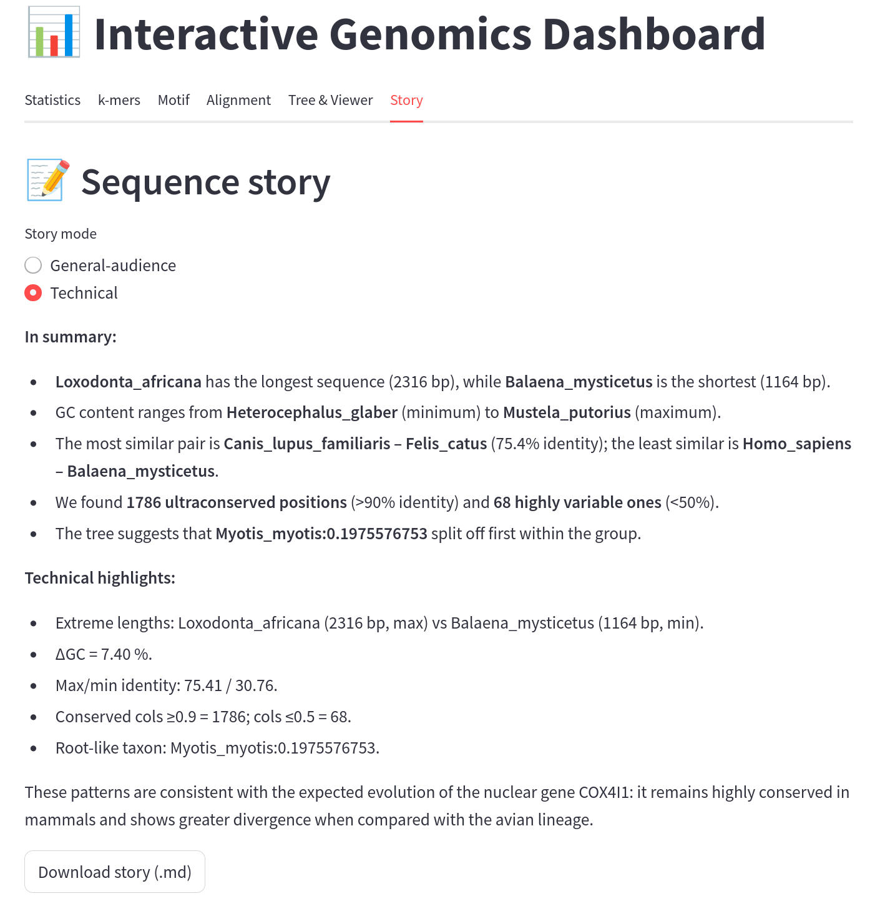

Interactive Genomics Dashboard
================

# 📊 Interactive Genomics Dashboard

Streamlit app to align FASTA sequences, compute k‑mer stats, find &
highlight motifs, build identity matrices, infer phylogenies (FastTree /
IQ-TREE), and auto‑generate a narrative for **general‑audience** or
**technical** readers. State is preserved with `st.session_state`, so
changing k‑mers, motifs, or story mode doesn’t recompute everything.

------------------------------------------------------------------------

## 🖼️ UI Preview

<p align="center">


</p>

------------------------------------------------------------------------

## 🚀 Quick start

1.  **Clone**

    ``` bash
    git clone https://github.com/YOURUSER/genomics-dashboard.git
    cd genomics-dashboard
    ```

2.  **Create environment (conda/mamba) or use pip**

    ``` bash
    mamba env create -f environment.yml
    mamba genomicsdashboard
    ```

3.  **(Recommended) Install external binaries**

    ``` bash
    conda install -c bioconda mafft clustalo fasttree iqtree
    ```

4.  **Run**

    ``` bash
    streamlit run app_en.py
    ```

    ------------------------------------------------------------------------

## ✨ Features

- FASTA upload & header cleanup  
- Multiple sequence alignment (MAFFT / Clustal Omega)  
- Identity matrix (styled) + CSV export  
- Motif search & highlighting  
- Conservation profile (gap‑penalized or not)  
- Phylogenetic tree (FastTree or IQ-TREE) with interactive viewer
  (PhylocanvasGL)  
- Auto “story” in **General‑audience** or **Technical** tone  
- Persistent UI state with `st.session_state`

------------------------------------------------------------------------

## 📂 Project structure

├── app_en.py \# English version ├── app_es.py \# Spanish version ├──
requirements.txt ├── environment.yml ├── data/ \# optional example FASTA
files ├── docs/ \# screenshots

------------------------------------------------------------------------

## 🧪 Example data

Put small demo FASTA files under `data/` and upload them via the UI.  
(If you add CLI flags to auto-load examples, document them here.)

------------------------------------------------------------------------

## ⚙️ Requirements

**Python ≥ 3.10**

Python libs (see `requirements.txt` / `environment.yml`): streamlit,
numpy, pandas, matplotlib, etc.

External tools (optional but needed for full functionality):

- MAFFT  
- Clustal Omega  
- FastTree  
- IQ-TREE 2

Ensure binaries are on your `$PATH`.

------------------------------------------------------------------------

## 🧠 How it works (high level)

1.  Parse FASTA, normalize headers.  
2.  Align sequences (MAFFT or Clustal Omega).  
3.  Compute identity matrix & conservation profiles.  
4.  Infer tree (FastTree or IQ-TREE) in a temp dir; render with
    PhylocanvasGL.  
5.  Generate a narrative summary (general vs technical).

------------------------------------------------------------------------

## 📸 More screenshots

### Statistics tab



### Identity matrix



### Motif search



### Multiple sequence alignment



### Conservation profile



### Tree viewer



### Story tab



------------------------------------------------------------------------

## ❗ Troubleshooting

**IQ-TREE exit status 2**  
→ Use `--redo` or a unique `--prefix` each run.

**“No tree file produced”**  
→ Check that the model string is valid (e.g., `GTR+G`), and outputs are
written inside the temp dir.

**Alignment empty / crashes**  
→ Verify FASTA formatting and headers. Ensure ≥2 sequences.

**Thread warnings**  
→ Use `-T AUTO` for IQ-TREE on small alignments.

------------------------------------------------------------------------

## 📚 Cite the tools

If you publish results produced with this app, please cite (add full
references):

- Katoh & Standley (2013) – MAFFT  
- Sievers et al. (2011) – Clustal Omega  
- Price et al. (2010) – FastTree  
- Minh et al. (2020) – IQ-TREE 2  
- PhylocanvasGL project  
- Streamlit

------------------------------------------------------------------------

## 📝 License

Specify your license (MIT, GPL-3.0, etc.) and include a `LICENSE` file.

------------------------------------------------------------------------

## 🤝 Contributing

Issues and PRs are welcome.  
Open an issue first for major changes; add screenshots/tests when
relevant.

------------------------------------------------------------------------

## 📬 Contact

**Julio Orellana-Montes**  
<julio.orellana@upch.pe>

**Adrian Chalco-Gonzalez** <adrian.chalco@upch.pe>
